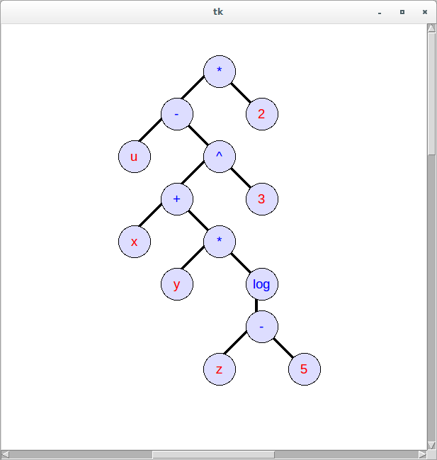

# Python experiments

Various experiments and examples on Python.

## ncurses/let-it-snow.py
Let it snow !


## backup.py
Small backup utility. Directories are hard coded in script.

Usage:

```
usage: backup.py [-h] [-w] [-n] [-d] [-l] [-e]

Sauvegarde de dossiers sur le disque dur tradtionnel. Dossiers: ...

optional arguments:
  -h, --help     show this help message and exit
  -w, --week     effectuer une sauvegarde hebdomadaire si necessaire
  -n, --now      effectuer une sauvegarde immédiatement
  -d, --display  afficher les sauvegardes disponibles
  -l, --log      afficher les dernières lignes du journal
  -e, --edit     editer ce script de sauvegarde
```

## installation-script.py
Installer une sélection de paquets via le gestionnaire de paquet apt.

Usage:

```
usage: installation-script.py [-h] [-i] [-e] [-ai] [-au] [-d]

Script d'installation. Execute des commandes, installe et désinstalle des
paquets spécifiés dans le fichier : /home/.../installation.json

optional arguments:
  -h, --help            show this help message and exit
  -i, --install         lancer le script
  -e, --edit            editer le fichier d'installation
  -ai, --append-packet-to-install
                        ajouter un paquet à installer
  -au, --append-packet-to-uninstall
                        ajouter un paquet à désinstaller
  -d, --display         montrer les commandes et paquets du fichier
```

## leet.py
Transformation de chaines.

Usage:

```
optional arguments:
  -h, --help  show this help message and exit
```

## memo.py
Gestion de mémos courts. Permet d'enregistrer des mémos et d'effectuer des recherches par mot clef.

Usage:

```
usage: memo.py [-h] [-e] [-a] [-d]

Utilitaire de mémorisation d'informations. Les informations sont
enregistrées dans le fichier: /home/.../memo.txt

optional arguments:
  -h, --help     show this help message and exit
  -e, --edit     editer le fichier de memo avec Vim
  -a, --append   ajouter un memo
  -d, --display  afficher l'intégralité du fichier
```

## notes.py
Gestion de notes longues. Permet d'enregistrer des notes et d'effectuer des recherches par mots-clef.
Usage:

```
usage: notes.py [-h] [-n] [-e] [-s] [-t] [-l] [-d] [-a] [-g]

Utilitaire de mémorisation de notes. Les notes sont enregistrées dans le
dossier: /home/remipassmoilesel/projects/python/python_scripts/notes/notes-
repository

optional arguments:
  -h, --help            show this help message and exit
  -n, --newnote         créer une nouvelle notes
  -e, --editnote        editer une note existante, identifiée par son nom
                        complet, partiel ou son numero d'ordre
  -s, --search          rechercher dans les notes
  -t, --edittemplate    editer le modèle de note
  -l, --list            lister les notes
  -d, --display         afficher une note
  -a, --displayall      afficher l'intégralité des notes
  -g, --graphicaleditor
                        utiliser un éditeur graphique
```

## chainedCommands.py
Utilitaire de commandes GNU/Linux en chaine.

```
C("log.txt").c("mkdir dir1").c("cd dir1").c("...")
```


## node.py
Utilitaires pour exercices sur les arbres.

Démonstration:

```
# Pour cet arbre:
tree1 = Node("*",
            Node("-",
                 Node("u"), Node("^",
                                 Node("+",
                                    Node("x"), Node("*",
                                                    Node("y"), Node("log",
                                                                    Node("-",
                                                                         Node("z"), Node("5"))))),
                                 Node("3"))),
             Node("2"))

TreeWindow(tree1).show()

# En ligne de comande:
$ ./node.py
```


